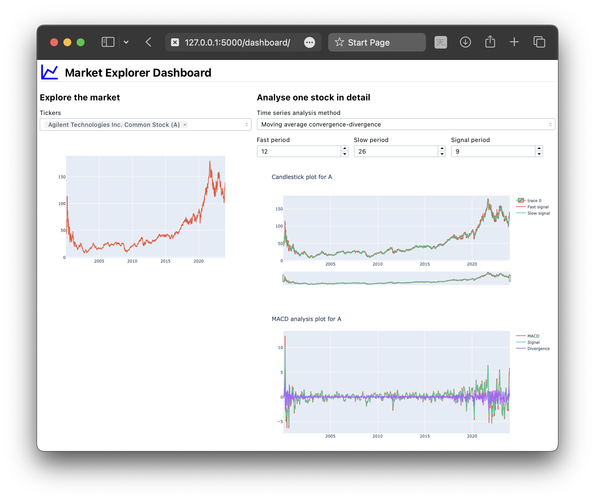

# Market Explorer &ndash; Browse and analyse market data

---



---

`Market Explorer` is a small web app built using:
- [Flask](https://flask.palletsprojects.com/en/3.0.x/) to serve the app
- [Dash](https://dash.plotly.com) as a dashboarding framework
- [ArcticDB](https://arcticdb.io) for caching and storing market data
- [Plotly](https://plotly.com/python/) to interactively visualise data and analyses
- [pandas](https://pandas.pydata.org) for data handling
- [yfinance](https://github.com/ranaroussi/yfinance) for fetching market data

Market data for desired products listed on e.g. the NASDAQ exchange can be plotted and analysed interactively.

Data are cached in an ArcticDB database to avoid redownloading over and over, 

## Quickstart

Market Explorer is packaged as a Conda environment specified in `./environment.yml`. While this package was developed on MacOS 14, it should work in any UNIX-like environment, such as a recent Ubuntu or Red Hat image.

### Installation

Create the `market-explorer` Conda environment with:
```sh
conda env create -f environment.yml
```

Create a `.env` file in the repository root, e.g. by copying the `.env.example` file, and change the environment variables as desired.

You will also need a dump of the NASDAQ tickers list from `https://api.nasdaq.com/api/screener/stocks?tableonly=true&download=true` placed inside `./data/nasdaq.json`.

### Running

Run the Market Explorer Flask app with:
```sh
python3 app.py
```

The Market Explorer app will be available (by default) at http://127.0.0.1:5000/dashboard/.

The first boot might be slightly slower due to importing the NASDAQ ticker list and storing in the local database.

---

